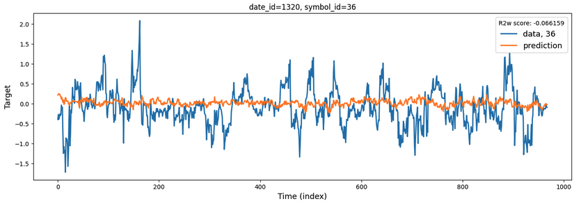
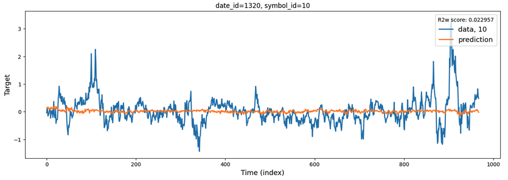

# Jane Street Real-Time Market Data Forecasting (Kaggle)

## Introduction

This is a competition on Kaggle hosted by **Jane Street** and can be found under this [link](https://www.kaggle.com/competitions/jane-street-real-time-market-data-forecasting).

## Description

This repository contains the code developed for processing of Jane Street financial data. The competition dataset comprises a set of timeseries with 79 features and 9 responders, anonymized but representing real market data. The goal of the competition is to forecast one of these responders, i.e., `responder_6`, for up to six months in the future.

The code for data processing has options to create various lag and sesonal features, as well as Fourier terms. The processed data is adapted for forecasting using global regression models as well as for using more sophisticated models for timeseries forecasting such as transformers, LSTM, N-BEATS, etc. Forecasting based on LightGBM model is implemented here, while other models are on the To-Do list.

# Example of predicted time-series using LightGBM model

Here are two random illustrations of predicted time-series compared to the target data.

